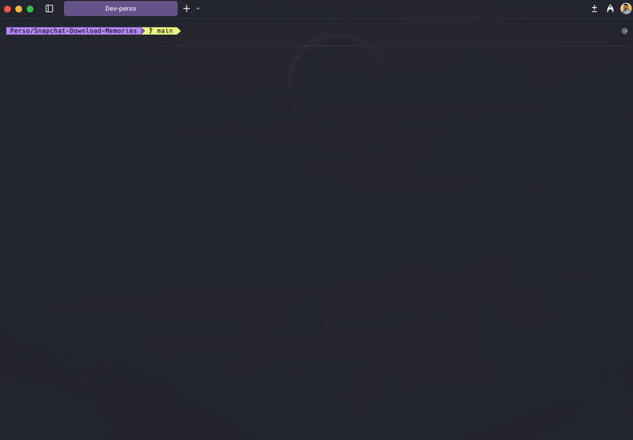

# Snapchat Memories Downloader

Automatically download **all** your Snapchat Memories in bulk, including timestamps, geolocation, and overlays (text/drawings).



## 📥 Getting your Snapchat Data

### 1. Login to your account
Login to Snapchat: [https://accounts.snapchat.com/](https://accounts.snapchat.com/)

### 2. Request your data export
Go to the export page: [https://accounts.snapchat.com/accounts/downloadmydata](https://accounts.snapchat.com/accounts/downloadmydata)

### 3. Export configuration
⚠️ **Important**: Select the following options:
- ✅ **Memories** (check this option)
- ✅ **HTML Format** (not JSON)

Confirm and wait to receive the download link by email (may take a few hours to a few days).

### 4. Download the file
Once received, download the ZIP file and **extract it**. You should have a `memories_history.html` file.

---

## 🚀 Installation and Usage

### Prerequisites
- **Python 3.10+**
- **uv** (recommended) or pip
- **ffmpeg** (optional, for video + overlay composition)

### 1. Clone or download this repository
```bash
git clone https://github.com/your-repo/Snapchat-Download-Memories.git
cd Snapchat-Download-Memories
```

### 2. Install dependencies

**Using uv (recommended):**
```bash
# Install uv if you don't have it
curl -LsSf https://astral.sh/uv/install.sh | sh

# Install dependencies
uv sync
```

**Using pip:**
```bash
pip install -r requirements.txt
```

### 3. Install ffmpeg (optional but recommended)
```bash
# macOS
brew install ffmpeg

# Linux (Ubuntu/Debian)
sudo apt install ffmpeg

# Windows
# Download from https://ffmpeg.org/download.html
```

### 4. Place your HTML file
Create an `html/` folder and place your `memories_history.html` in it:
```
Snapchat-Download-Memories/
├── html/
│   └── memories_history.html  ← Your file here
├── main.py
└── src/
```

### 5. Run the script
```bash
python main.py
```

The script will prompt you with 3 configuration choices:

#### 📁 File Organization
1. **By date (year/month folders)** - *Recommended* - Organized like `2025/12/`
2. **All in one folder** - Everything in `snapchat_memories/` root

#### 📝 Filename Format
1. **20251215_213158** - Compact format *(default)*
2. **2025-12-15_21-31-58** - Readable format
3. **2025-12-15** - Date only (no time)
4. **20251215** - Compact date only

#### 🗜️ ZIP File Processing
1. **Keep everything**: original + separate overlay + composed version *(Recommended)*
2. **Composed only**: final version with overlay only
3. **Original only**: media without overlay
4. **Original + composed**: both versions (without separate PNG overlay)

### 📂 Download Location

By default, all your memories will be downloaded to the `snapchat_memories/` folder in the project directory.

**Want to change the output location?**
Edit the `OUTPUT_DIR` variable in [`src/config.py`](src/config.py):
```python
OUTPUT_DIR = "snapchat_memories"  # Change this to your preferred path
```

You can use:
- Relative paths: `"my_memories"`
- Absolute paths: `"/Users/yourname/Documents/Snapchat"`
- Cloud folders: `"/Users/yourname/Dropbox/Snapchat"`

---

## ✨ Features

- 🚄 **Ultra-fast parallel download** (30 simultaneous threads)
- 📅 **Automatic organization by date** (year/month)
- 🏷️ **Filenames based on real date** (e.g., `20251215_213158.jpg`)
- 🔍 **Intelligent format detection** (Content-Type + magic bytes)
- 📦 **Automatic ZIP processing** (media + PNG overlay)
- 🎨 **Image + overlay composition** (automatic overlay)
- 🎬 **Video + overlay composition** (via ffmpeg)
- 🕐 **Date metadata preservation** (file modification date)
- 📍 **Geolocation extraction** (from HTML)

---

## 📁 Output Structure

Your memories will be organized like this:

```
snapchat_memories/
├── 2025/
│   ├── 12/
│   │   ├── 20251215_213158.jpg              # Original image
│   │   ├── 20251215_213158_overlay.png      # Overlay (text/drawing)
│   │   ├── 20251215_213158_composed.jpg     # Image + overlay composed
│   │   ├── 20251215_214230.mp4              # Original video
│   │   ├── 20251215_214230_overlay.png      # Video overlay
│   │   └── 20251215_214230_composed.mp4     # Video + overlay
│   └── 11/
│       └── ...
├── 2024/
│   └── ...
└── 2018/
    └── ...
```

---

## 🎯 ZIP File Processing Options

Some memories are exported as ZIP files containing:
- The original media (image or video)
- A PNG overlay (text, drawings, stickers added on Snapchat)

The script offers 4 options at startup:

| Option | Description | Files Created |
|--------|-------------|---------------|
| **1. Keep everything** | Keeps everything separately + composed version | `_original`, `_overlay.png`, `_composed` |
| **2. Composed only** | Final version only | `20251215_213158.jpg` |
| **3. Original only** | Media without overlay | `20251215_213158.jpg` |
| **4. Original + composed** | Both versions | `_original`, `_composed` |

---

## ⚙️ Advanced Configuration

You can modify settings in `src/config.py`:

```python
HTML_FILE = "html/memories_history.html"  # HTML file path
OUTPUT_DIR = "snapchat_memories"           # Output folder
MAX_WORKERS = 30                           # Number of parallel threads
TIMEOUT = 30                               # Timeout per download (seconds)
```

---

## 🔧 Troubleshooting

### Script cannot find HTML file
- ✅ Check that the file is in `html/memories_history.html`
- ✅ Make sure you extracted the ZIP received from Snapchat

### Download links expire
- ⚠️ Links in the HTML expire after a few days
- 🔄 Request a new export from Snapchat

### Composed images are not created
- ⚠️ Check that Pillow is installed: `pip install Pillow`
- ℹ️ Without Pillow, only original files and overlays will be saved

### Composed videos are not created
- ⚠️ Check that ffmpeg is installed: `ffmpeg -version`
- ℹ️ Without ffmpeg, only original videos and PNG overlays will be saved

### Error "No module named 'src'"
- ✅ Run the script from the root folder: `python main.py`
- ❌ Don't run from the `src/` folder

### Some files are .dat
- ℹ️ Some files have an unknown format (incorrect Content-Type)
- 🔄 Re-run the script, magic bytes detection should fix them

---

## 📝 Logs and Statistics

The script displays in real-time:
- 📊 Number of memories found
- 📥 Download progress (progress bar)
- ✓ Number of successes / skipped / failures
- 📦 Total size downloaded
- ⏱️ Elapsed time and average speed
- 🗜️ Number of ZIPs processed

---

## 🐛 Issues?

If you encounter a problem not listed above, please [create an issue](https://github.com/your-repo/Snapchat-Download-Memories/issues) with:
- The complete error message
- Your Python version (`python --version`)
- Your operating system

---

## 📜 License

MIT License - Feel free to use this project!
